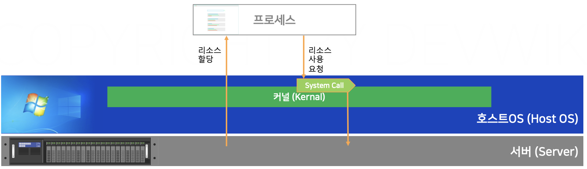

# 섹션 2 - 가상화 기술

## 서버란?

하드웨어와 하드웨어에서 실행 중인 소프트웨어까지 모두 포함한 단어 (문맥에 따라 이해)

## 서버의 분류

서버에서 어떤 소프트웨어가 실행 중인지에 따라 분류됨

1. 파일서버
    
    파일 업로드 / 다운로드
    
2. DB 서버
    
    데이터 조회 / 입력
    
3. 웹서버 (WEB)
    
    웹 페이지
    
    클라이언트가 요청하면 주로 정적인 리소스를 응답해줌 (Nginx)
    
4. 웹 애플리케이션 서버 (WAS)
    
    애플리케이션
    
    프로그래밍 언어로 개발된 백엔드 애플리케이션을 실행하는 서버
    

## 서버 운영 방식

1. 베어메탈
    
    하나의 하드웨어에 OS를 설치하고 여러 소프트웨어를 실행시키는 방식
    
    비효율적임!!
    
2. 하이퍼바이저
3. 컨테이너 (Docker가 다루는 기술)

## 가상화 기술이란?

물리적인 컴퓨팅 환경에서 논리적인 컴퓨팅 환경을 만들 수 있는 기술

## 가상화 기술을 사용해야하는 이유

가정) 하나의 OS에서 여러 프로그램을 사용할 때

1. 하나의 프로그램에 문제가 발생할 경우 나머지 프로그램에 영향을 줄 수 있음
2. 하나의 프로그램의 리소스가 급증하면 나머지 프로그램이 정상적으로 동작하지 않을 수 있음

## 가상화 기술의 특징

1. 한 대의 컴퓨터에 여러 논리적인 OS를 만들 수 있다.
2. 각각의 가상 OS의 리소스 사용량을 제한할 수 있다.
3. 각각의 가상 OS는 논리적으로 격리되어 있다.

## 하이퍼바이저

### 들어가기 전

하드웨어는 아주 복잡하고 조심히 다뤄야 하는 것이기 때문에 OS는 다양한 프로세스에서 하드웨어를 다룰 수 있도록 커널로 요청하도록 했다.

이 사용 요청을 대신 전달해주는 System Call 표준을 만들었다.

→ `프로세스가 커널에 System Call을 보내도록 함`

### 하이퍼바이저란?

하이퍼바이저는 호스트 OS와 격리된 새로운 게스트 OS를 실행할 수 있도록 도와주는 소프트웨어이다.

하이퍼바이저를 설치해 논리적으로 격리된 게스트 OS인 가상 머신을 만들어 가상 환경을 구성할 수 있다.

호스트 OS 종류와 다른 게스트 OS를 사용할 때 System Call의 요청 방식이 다를 수 있는데, 하이퍼바이저가 두 OS 간의 불일치를 해결해줌 (통역 역할)

## 컨테이너 가상화

컨테이너는 리눅스 커널이 제공하는 LXC(LinuX Containers) 라는 자체 격리 기술에서 출발했다.

LXC는 격리된 공간을 프로세스에게 만들어주기 위해 커널의 네임스페이스와 CGroups 라는 기능을 활용했다. 이때 각각의 격리된 공간을 `컨테이너` 라고 부른다.

→ 네임스페이스는 리소스를 나누는 기준, Cgroups는 리소스 사용량을 배분하는 기술!

위 그림과 같이 호스트 OS 커널을 모든 컨테이너가 공유한다. 하이퍼바이저와 다르게 컨테이너 내부에 커널(OS)가 존재하지 않아 오버헤드가 적고 빠른 부팅이 가능하다.

## 도커

### 도커란?

커널의 가상화 기술인 컨테이너를 편리하게 사용할 수 있도록 도와주는 소프트웨어이다.

도커는 컨테이너 플랫폼이라고 불리고, 컨테이너 엔진, 컨테이너 런타임으로 구성되어있다.

컨테이너 엔진은 사용자의 요청을 받아서 컨테이너를 관리해주는 역할을 한다.

컨테이너 런타임은 직접 커널과 통신하면서 실제로 격리된 공간을 만드는 역할을 수행한다. (Runc)

### 도커의 특징

도커는 클라이언트 - 서버 모델이다.

사용자의 명령을 전달해주는 클라이언트와 컨테이너를 관리해주는 도커 데몬으로 구성되어 있다.

데몬이란? - 서버에서 지속적으로 실행되는 소프트웨어를 의미한다.

도커 데몬은 클라이언트가 기능을 이용할 수 있도록 API를 제공한다.

도커 데몬이 제공하는 API는 양식에 맞춰 요청하거나 응답 값을 파악하고 사용하는데 어려움이 있어 Docker CLI가 클라이언트 툴로써 제공된다.

