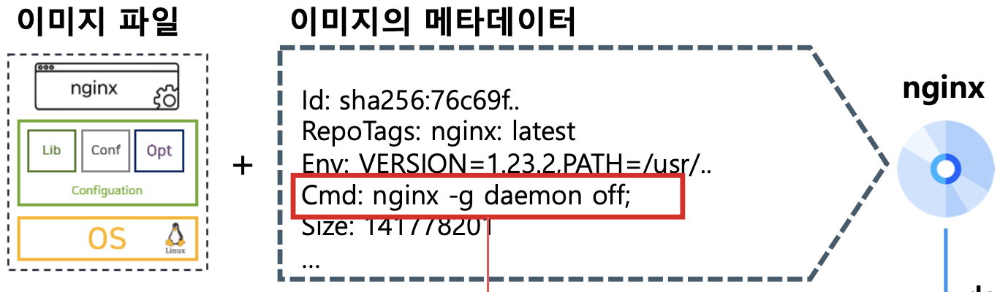
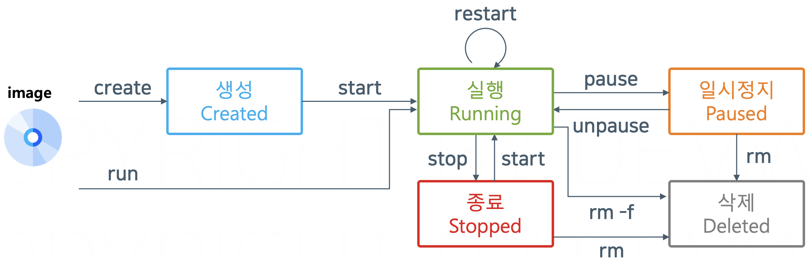

# 섹션 3 - 이미지와 컨테이너

---

## 프로그램을 실행시키기 위해서는…

1. OS : 하드웨어 자원을 사용하기 위한 소프트웨어
2. 구성 파일 : 프로그램을 실행시키기 위해서 필요한 기능을 모아둔 소프트웨어
3. 프로그램 : 실행시킬 소프트웨어

가 필요하다!

## 도커 이미지란?

<aside>
💡

프로그램을 실행시킬 수 있는 상태의 파일시스템을 저장한 압축 파일

</aside>

### 장점

- 프로그램을 실행시킬 수 있는 상태이기 때문에 간편하다.
- 백업, 스냅샷 등에 비해 가볍다.
- 다른 사람이 만든 것을 사용할 수 있다.

## 도커 컨테이너란?

<aside>
💡

도커 이미지를 실행시킨 상태

</aside>

프로그램, 프로세스 관계와 같다.

### 프로그램이란?

- 실행 가능한 소프트웨어
- 디스크 공간 차지

### 프로세스란?

- 실행 상태의 소프트웨어
- 하나의 프로그램은 여러 개의 프로세스를 만들 수 있다.
- CPU, MEM 등의 리소스 사용

### 도커 이미지와 도커 컨테이너

- 이미지
    - 소프트웨어 + 환경
    - 디스크 공간 차지
- 컨테이너
    - 실행 상태의 이미지
    - 하나의 이미지는 여러 개의 컨테이너를 만들 수 있다.
    - CPU, MEM 등의 리소스 사용

### 프로세스와 다른 컨테이너의 특징

1. 컨테이너 간 리소스 격리
2. 이미지 안의 파일 시스템 요소를 격리된 컨테이너 공간에 옮기고(복사), 프로그램을 실행시켜 프로세스를 만듦
3. 컨테이너 실행 시 프로세스도 실행

## 이미지의 메타데이터

- 메타데이터란?
    
    데이터에 대한 데이터
    

Id : 이미지 아이디

RepoTags : 이미지 이름

Env : 컨테이너 내부 환경변수

Cmd : 컨테이너 내부에서 프로그램 실행 명령어

Size : 이미지 크기

<aside>
💡

이미지가 컨테이너로 복사될 때 메타데이터도 복사가 되어 프로그램 실행 시 사용될 수 있다.

그리고 메타데이터는 컨테이너가 실행될 때 덮어쓸 수 있다.

</aside>

## 컨테이너의 라이프사이클

프로세스의 라이프사이클과 컨테이너의 라이프사이클이 매우 유사함!