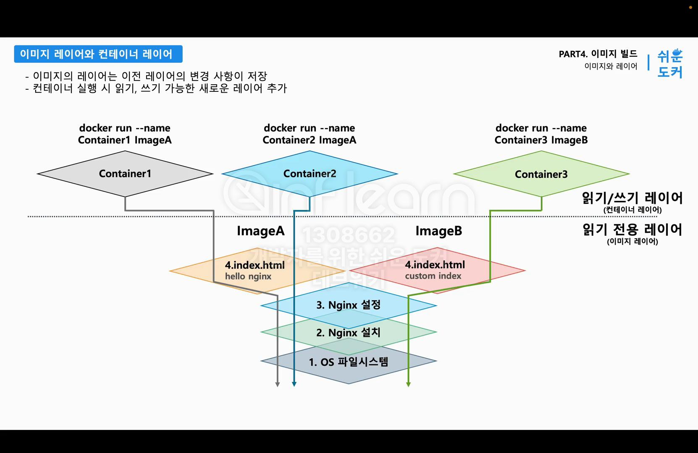

# 섹션 5 - 이미지 빌드

---

## 이미지 레이어 (읽기 전용)

이전 레이어의 변경사항을 현재 이미지 레이어에 저장한다.

### Layered File System

도커 저장소는 Layered File System으로 구성되어있다. → 이미지가 겹겹이 쌓여있음.

[ 장점 ]

1. 변경사항에 있어 재활용에 유리하다.
2. 재사용할 수 있어 효율적으로 데이터를 저장하고 전송 가능하다.
3. 중복 데이터를 최소화한다.
4. 빌드된 레이어를 캐싱함으로써 빌드 속도를 높인다.

이미지는 읽기 전용이기 때문에 이미지를 수정할 경우 원본 파일의 복사본을 만들어서 변경 사항을 적용한다. (CoW 전략)

## 컨테이너 레이어 (읽기/쓰기)

컨테이너 실행 시 읽기, 쓰기 가능한 새로운 레이어가 추가된다.

컨테이너 실행 이후 프로세스의 변경 사항을 기록한다.



## 이미지 커밋 & 빌드

크게 두 가지 방식이 있다.

1. 컨테이너를 `commit` 
2. 도커 파일을 `build`

### IaC 란?

IaC(Infrastructure as Code): 인프라 상태를 코드로 관리

사람은 원하는 상태를 코드로 작성하고, 프로그램이 코드를 읽어 인프라를 관리한다. (휴먼 에러가 발생하지 않음!)

이전 코드를 저장할 수 있어 코드의 버전 관리를 할 수 있다.

### 이미지 커밋


읽기/쓰기 레이어의 상태가 이미지로 저장됨

[ 단점 ]

- 이미지를 생성하기 위해서 컨테이너를 실행해야한다.
- 여러 개의 이미지를 생성하기 위해서 여러 번의 커밋을 수행해야한다.
- 사람이 직접 코드를 수행해야한다.

### 이미지 빌드

`docker build` 명령어로 도커 데몬이 이미지를 생성한다.

1. 임시 컨테이너 생성
2. 변경사항 적용 후 커밋 (새로운 레이어)
3. 임시 컨테이너 삭제

위 과정을 자동으로 수행해준다.

이때 이미지를 어떻게 만들지 등 구체적인 작업 내용은 `Dockerfile` 에 작성한다.

IoC 방식에 따라 이미지를 `Dockerfile` 이라는 소스 코드로 관리할 수 있다.

### Dockerfile 지시어

```json
FROM 이미지명
```

→ 베이스 이미지를 지정

```json
COPY 파일경로 복사할경로
```

→ 파일을 레이어로 복사 (레이어 추가)

```json
CMD ["명령어"]
```

→ 컨테이너 실행 시 명령어 지정
작성한 명령어는 메타데이터의 CMD 필드에 저장이 됨

```json
RUN 명령어
```

→ 명령어 실행 (레이어 추가)

```json
WORKDIR 폴더명
```

→ 작업 디렉토리를 지정 (레이어 추가)

```json
USER 유저명
```

→ 명령을 실행할 사용자 변경 (레이어 추가)

```json
EXPOSE 포트번호
```

→ 컨테이너가 사용할 포트를 명시
컨테이너의 모든 포트가 열려있음에도 옵션을 사용하는 이유는 문서적으로 명시하기 위함

```json
ARG 변수명 변수값

docker build --build-arg 변수명=변수값 으로 덮어쓰기 가능
```

→ 이미지 빌드 시점의 환경 변수 설정

```json
ENV 변수명 변수값

docker run -e 변수명=변수값 으로 덮어쓰기 가능
```

→ 이미지 빌드 및 컨테이너 실행 시점의 환경 변수 설정 (레이어 추가)

```json
ENTRYPOINT ["명령어"]
```

→ 고정된 명령어 지정

보통 파일 시스템에 영향을 주면 새로운 레이어가 추가된다고 함!

### 빌드 컨텍스트

빌드 시 도커 데몬에게 도커 파일과 빌드에 사용되는 파일들을 전달해야한다.

이때 전달하게 되는 폴더가 빌드 컨텍스트이다.

COPY 명령어를 사용할 때 빌드 컨텍스트에 있는 파일이 복사되는 것임!

`docker build -t 이미지명 빌드컨텍스트`

- 빌드 컨텍스트 폴더 내부에는 도커 파일과 빌드에 필요한 파일이 모두 들어있어야 한다.
- `.dockerignore` 파일을 사용해 빌드 컨텍스트에 전달하지 않을 파일을 지정할 수 있다.

## 멀티 스테이지 빌드

보통 빌드된 파일들이 용량을 많이 차지하고, 실제 애플리케이션 실행되는 데 사용되지 않기 때문에 하나의 이미지에 모아놓는 것은 비효율적이다.

→ 빌드에 사용하는 이미지, 실행에 사용하는 이미지를 나눔


```json
FROM maven:3.6 AS build
WORKDIR /app

COPY pom.xml .
COPY src ./src

RUN mvn clean package

FROM openjdk:11-jre-slim
WORKDIR /app

COPY --from=build /app/target/*.jar ./app.jar --> --from으로 가져올 스테이지를 지정 가능

EXPOSE 8080
CMD ["java", "-jar", "app.jar"]  
```

멀티 스테이지 빌드를 수행하면 도커가 두 개의 컨테이너를 동시에 띄워 이미지를 빌드한다.